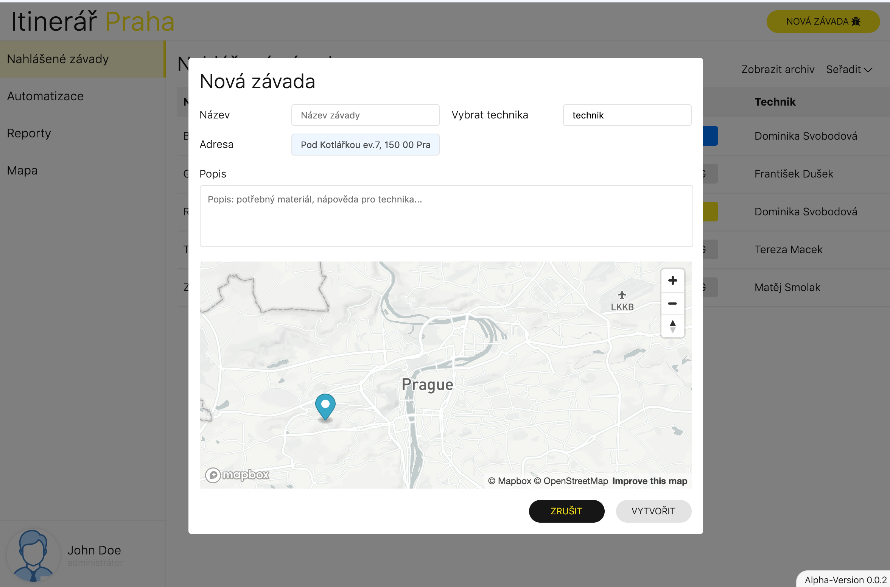

# Moment

Prague Itenerary prototype
Semester project for Information Systems (INS)



System allows you to manage itinerary issues across the city.

## Development

Install globaly Json-server  
`yarn global add json-server`
*skip if already installed. More about json-server [here](https://github.com/typicode/json-server).*

Run `json-server --watch data/db.json` to start local API for development.

Install dependencies with `yarn install` and `yarn start` to run application locally.  
*You can use npm alternately*

Create your **proces.env.ts** file with variables inside *./environmets* folder.

```ts
export const PROCESS = {
	MAPBOX: '<YOUR_MAPBOX_API_KEY>',
	OPENCAGE: '<YOUR_OPENCAGE_API_KEY>'
}
```

You can manage Mapbox tokens [here](https://account.mapbox.com/auth/signin/?route-to=%22/access-tokens/%22) and Opencage tokens [here](https://opencagedata.com/api)  
*Registrations required*

Open your browser on `http://localhost:4200/`.

Application requires login, you can find login and password in *./data/db.json*  in *users* collection.  
For example you can login as admn with:

```
email: john.doe@gmail.com
password: 1qaz2wsx
```